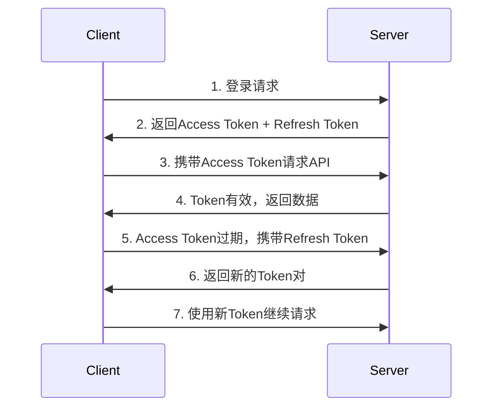

# Mall 商城管理后台 API 使用说明

## 项目概述

本项目是一个基于 Node.js + Express + MongoDB 的商城管理后台系统，提供完整的RESTful API接口。

### 技术栈
- **后端**: Node.js + Express + MongoDB + Redis + JWT
- **前端**: React 18 + Ant Design + Redux Toolkit
- **数据库**: MongoDB (用户数据) + Redis (缓存/会话)
- **认证**: JWT 双Token机制

### 服务地址
- **开发环境**: http://localhost:3001
- **前端代理**: http://localhost:3000/api

## 详细对接规范

### 1. 请求规范

#### 1.1 请求格式要求
- **Content-Type**: `application/json` (必须)
- **字符编码**: UTF-8
- **请求方法**: 严格按照接口文档指定的HTTP方法
- **URL编码**: 路径参数需要进行URL编码
- **请求体大小**: 单次请求不超过10MB

#### 1.2 请求头规范
```http
Content-Type: application/json
Authorization: Bearer <access_token>  # 需要认证的接口必须携带
User-Agent: YourAppName/1.0.0         # 建议携带应用标识
X-Request-ID: uuid-v4                 # 建议携带请求追踪ID
Accept: application/json
```

#### 1.3 参数验证规则
- **必填参数**: 不能为空、null、undefined
- **字符串长度**: 
  - 用户名: 3-50字符
  - 密码: 6-128字符
  - 邮箱: 符合RFC 5322标准
  - 验证码: 4位字符
- **数据类型**: 严格按照接口文档要求的数据类型
- **特殊字符**: 需要进行适当的转义处理

### 2. 响应规范

#### 2.1 统一响应格式
所有API接口统一返回以下格式：

```json
{
  "code": 200,           // 业务状态码（必须）
  "message": "操作成功",  // 响应消息（必须）
  "data": {},           // 响应数据（可选，可能为对象、数组或null）
  "timestamp": "2024-01-15T10:30:00.000Z",  // 服务器时间戳（可选）
  "requestId": "uuid-v4" // 请求追踪ID（可选）
}
```

#### 2.2 响应头规范
```http
Content-Type: application/json; charset=utf-8
X-Response-Time: 150ms                    # 响应时间
X-Request-ID: uuid-v4                     # 请求追踪ID
X-Rate-Limit-Remaining: 999               # 剩余请求次数
X-New-Access-Token: <token>               # Token刷新时返回新Token
X-Token-Refreshed: true                   # Token是否已刷新
```

### 3. 认证与授权规范

#### 3.1 JWT Token规范
- **Access Token**: 
  - 有效期: 15分钟
  - 用途: API访问认证
  - 存储位置: 请求头 Authorization
  - 格式: `Bearer <token>`
- **Refresh Token**: 
  - 有效期: 7天
  - 用途: 刷新Access Token
  - 存储位置: 安全存储（localStorage/sessionStorage）
  - 使用场景: Token过期时自动刷新

#### 3.2 Token使用流程


#### 3.3 权限验证规范
- **白名单接口**: 无需Token验证
  - `/auth/login`
  - `/auth/refresh`
  - `/captcha/generate`
  - `/captcha/verify`
  - `/captcha/refresh`
  - `/test`
- **认证接口**: 需要有效的Access Token
- **权限接口**: 需要特定权限的Token

### 4. 错误处理规范

#### 4.1 HTTP状态码与业务状态码对应关系
| HTTP状态码 | 业务状态码 | 说明 | 处理建议 |
|-----------|-----------|------|----------|
| 200 | 200 | 请求成功 | 正常处理响应数据 |
| 400 | 400 | 请求参数错误 | 检查请求参数格式和内容 |
| 401 | 401 | 未授权或Token过期 | 重新登录或刷新Token |
| 403 | 403 | 权限不足 | 提示用户权限不足 |
| 404 | 404 | 资源不存在 | 检查请求路径和参数 |
| 429 | 429 | 请求频率限制 | 延迟重试 |
| 500 | 500 | 服务器内部错误 | 稍后重试或联系技术支持 |

#### 4.2 详细错误码定义
```json
{
  "code": 400,
  "message": "请求参数错误",
  "data": {
    "errorCode": "INVALID_PARAMETER",
    "errorDetails": [
      {
        "field": "loginAccount",
        "message": "用户名不能为空",
        "code": "REQUIRED"
      },
      {
        "field": "password",
        "message": "密码长度必须在6-128字符之间",
        "code": "LENGTH_INVALID"
      }
    ]
  }
}
```

#### 4.3 错误处理最佳实践
```javascript
// 前端错误处理示例
try {
  const response = await api.login(loginData);
  // 处理成功响应
  handleSuccess(response.data);
} catch (error) {
  if (error.response) {
    // 服务器返回错误响应
    const { status, data } = error.response;
    switch (status) {
      case 400:
        handleValidationError(data);
        break;
      case 401:
        handleAuthError();
        break;
      case 500:
        handleServerError();
        break;
      default:
        handleUnknownError(error);
    }
  } else if (error.request) {
    // 网络错误
    handleNetworkError();
  } else {
    // 其他错误
    handleUnknownError(error);
  }
}
```

### 5. 安全规范

#### 5.1 数据传输安全
- **HTTPS**: 生产环境必须使用HTTPS
- **敏感数据**: 密码等敏感信息不得在URL中传输
- **数据加密**: 敏感数据建议进行客户端加密
- **防重放**: 重要操作建议添加时间戳和签名验证

#### 5.2 输入验证安全
- **SQL注入防护**: 后端使用参数化查询
- **XSS防护**: 对用户输入进行HTML转义
- **CSRF防护**: 使用CSRF Token或SameSite Cookie
- **文件上传**: 严格验证文件类型和大小

#### 5.3 访问控制安全
- **频率限制**: 
  - 登录接口: 5次/分钟
  - 验证码接口: 10次/分钟
  - 普通接口: 100次/分钟
- **IP白名单**: 管理接口可配置IP白名单
- **会话管理**: Token及时失效和清理

### 6. 性能规范

#### 6.1 响应时间要求
- **登录接口**: < 2秒
- **查询接口**: < 1秒
- **更新接口**: < 3秒
- **文件上传**: < 30秒

#### 6.2 并发处理能力
- **最大并发**: 1000 QPS
- **数据库连接池**: 最大50个连接
- **Redis连接池**: 最大20个连接

#### 6.3 缓存策略
- **验证码**: Redis缓存，5分钟过期
- **用户信息**: Redis缓存，30分钟过期
- **静态数据**: 内存缓存，1小时过期

### 7. 监控与日志规范

#### 7.1 请求日志格式
```json
{
  "timestamp": "2024-01-15T10:30:00.000Z",
  "requestId": "uuid-v4",
  "method": "POST",
  "url": "/auth/login",
  "userAgent": "Mozilla/5.0...",
  "ip": "192.168.1.100",
  "userId": "507f1f77bcf86cd799439011",
  "responseTime": 150,
  "statusCode": 200,
  "requestSize": 256,
  "responseSize": 1024
}
```

#### 7.2 错误日志格式
```json
{
  "timestamp": "2024-01-15T10:30:00.000Z",
  "level": "ERROR",
  "requestId": "uuid-v4",
  "message": "Database connection failed",
  "stack": "Error: Connection timeout...",
  "context": {
    "userId": "507f1f77bcf86cd799439011",
    "operation": "user_login",
    "parameters": {"loginAccount": "admin"}
  }
}
```

### 8. 版本控制规范

#### 8.1 API版本管理
- **版本格式**: v1, v2, v3...
- **版本位置**: URL路径 `/api/v1/auth/login`
- **向下兼容**: 新版本保持向下兼容至少6个月
- **废弃通知**: 提前3个月通知API废弃

#### 8.2 版本升级策略
```http
# 请求头指定版本
API-Version: v2

# 响应头返回版本信息
API-Version: v2
API-Deprecated: v1 will be deprecated on 2024-06-01
```

## API 接口文档

### 1. 认证相关接口

#### 1.1 用户登录
**接口地址**: `POST /auth/login`

**请求规范**:
- **Content-Type**: `application/json`
- **频率限制**: 5次/分钟/IP
- **超时时间**: 30秒

**请求参数**:
| 参数名 | 类型 | 必填 | 长度限制 | 说明 | 示例 |
|--------|------|------|----------|------|------|
| loginAccount | string | 是 | 3-50字符 | 登录账号，支持用户名/邮箱 | "admin" |
| password | string | 是 | 6-128字符 | 用户密码，明文传输 | "123456" |
| captcha | string | 是 | 4字符 | 图片验证码，不区分大小写 | "ABCD" |
| sessionId | string | 是 | UUID格式 | 验证码会话ID | "550e8400-e29b-41d4-a716-446655440000" |

**请求示例**:
```json
{
  "loginAccount": "admin",
  "password": "123456",
  "captcha": "ABCD",
  "sessionId": "550e8400-e29b-41d4-a716-446655440000"
}
```

**成功响应** (HTTP 200):
```json
{
  "code": 200,
  "message": "登录成功",
  "data": {
    "user": {
      "_id": "507f1f77bcf86cd799439011",
      "loginAccount": "admin",
      "email": "admin@example.com",
      "FirstLevelNavigationID": []
    },
    "accessToken": "eyJhbGciOiJIUzI1NiIsInR5cCI6IkpXVCJ9...",
    "refreshToken": "eyJhbGciOiJIUzI1NiIsInR5cCI6IkpXVCJ9...",
    "expiresIn": 900,
    "tokenType": "Bearer"
  },
  "timestamp": "2024-01-15T10:30:00.000Z"
}
```

**错误响应**:

*参数错误* (HTTP 400):
```json
{
  "code": 400,
  "message": "请求参数错误",
  "data": {
    "errorCode": "INVALID_PARAMETER",
    "errorDetails": [
      {
        "field": "loginAccount",
        "message": "登录账号不能为空",
        "code": "REQUIRED"
      }
    ]
  }
}
```

*验证码错误* (HTTP 400):
```json
{
  "code": 400,
  "message": "验证码错误或已过期",
  "data": {
    "errorCode": "CAPTCHA_INVALID",
    "remainingAttempts": 4
  }
}
```

*认证失败* (HTTP 401):
```json
{
  "code": 401,
  "message": "用户名或密码错误",
  "data": {
    "errorCode": "AUTH_FAILED",
    "remainingAttempts": 4,
    "lockoutTime": null
  }
}
```

*频率限制* (HTTP 429):
```json
{
  "code": 429,
  "message": "登录尝试过于频繁，请稍后再试",
  "data": {
    "errorCode": "RATE_LIMIT_EXCEEDED",
    "retryAfter": 60
  }
}
```

**对接注意事项**:
1. 登录前必须先调用验证码生成接口获取sessionId
2. 密码传输建议使用RSA加密（可选）
3. 登录成功后需要保存accessToken和refreshToken
4. 连续5次登录失败将锁定账户10分钟
5. Token需要安全存储，避免XSS攻击

#### 1.2 刷新Token
**接口地址**: `POST /auth/refresh`

**请求参数**:
```json
{
  "refreshToken": "eyJhbGciOiJIUzI1NiIsInR5cCI6IkpXVCJ9..."
}
```

**响应示例**:
```json
{
  "code": 200,
  "message": "Token刷新成功",
  "data": {
    "accessToken": "eyJhbGciOiJIUzI1NiIsInR5cCI6IkpXVCJ9...",
    "refreshToken": "eyJhbGciOiJIUzI1NiIsInR5cCI6IkpXVCJ9..."
  }
}
```

#### 1.3 用户登出
**接口地址**: `POST /auth/logout`

**请求头**: `Authorization: Bearer <access_token>`

**响应示例**:
```json
{
  "code": 200,
  "message": "登出成功",
  "data": null
}
```

#### 1.4 获取当前用户信息
**接口地址**: `GET /auth/me`

**请求头**: `Authorization: Bearer <access_token>`

**响应示例**:
```json
{
  "code": 200,
  "message": "获取用户信息成功",
  "data": {
    "_id": "507f1f77bcf86cd799439011",
    "loginAccount": "admin",
    "email": "admin@example.com",
    "FirstLevelNavigationID": []
  }
}
```

### 2. 验证码相关接口

#### 2.1 生成验证码
**接口地址**: `GET /captcha/generate`

**请求规范**:
- **请求方法**: GET
- **认证要求**: 无需Token
- **频率限制**: 10次/分钟/IP
- **缓存策略**: 不缓存

**请求参数**: 无

**成功响应** (HTTP 200):
```json
{
  "code": 200,
  "message": "验证码生成成功",
  "data": {
    "sessionId": "550e8400-e29b-41d4-a716-446655440000",
    "captchaImage": "data:image/svg+xml;base64,PHN2ZyB3aWR0aD0iMTIwIiBoZWlnaHQ9IjQwIj4uLi4=",
    "expiresIn": 300,
    "width": 120,
    "height": 40,
    "length": 4
  },
  "timestamp": "2024-01-15T10:30:00.000Z"
}
```

**响应字段说明**:
| 字段名 | 类型 | 说明 |
|--------|------|------|
| sessionId | string | 验证码会话ID，用于后续验证 |
| captchaImage | string | Base64编码的SVG图片数据 |
| expiresIn | number | 过期时间（秒），默认300秒 |
| width | number | 图片宽度（像素） |
| height | number | 图片高度（像素） |
| length | number | 验证码字符长度 |

**错误响应**:

*频率限制* (HTTP 429):
```json
{
  "code": 429,
  "message": "验证码生成过于频繁，请稍后再试",
  "data": {
    "errorCode": "RATE_LIMIT_EXCEEDED",
    "retryAfter": 60
  }
}
```

**对接注意事项**:
1. 验证码图片为SVG格式，可直接在img标签中使用
2. sessionId必须保存，用于登录时验证
3. 验证码5分钟后自动过期
4. 建议在用户点击验证码图片时刷新验证码

#### 2.2 验证验证码
**接口地址**: `POST /captcha/verify`

**请求参数**:
```json
{
  "sessionId": "uuid-string",
  "captcha": "ABCD"
}
```

**响应示例**:
```json
{
  "code": 200,
  "message": "验证码验证成功",
  "data": {
    "valid": true
  }
}
```

#### 2.3 刷新验证码
**接口地址**: `POST /captcha/refresh`

**请求参数**:
```json
{
  "sessionId": "old-uuid-string"  // 可选，旧的会话ID
}
```

**响应示例**:
```json
{
  "code": 200,
  "message": "验证码刷新成功",
  "data": {
    "sessionId": "new-uuid-string",
    "captchaImage": "data:image/svg+xml;base64,PHN2ZyB3aWR0aD0i...",
    "expiresIn": 300
  }
}
```

### 3. 用户管理接口

#### 3.1 获取用户信息
**接口地址**: `GET /auth/userinfo` 或 `GET /auth/userinfo/:userId`

**请求头**: `Authorization: Bearer <access_token>`

**响应示例**:
```json
{
  "code": 200,
  "message": "获取用户信息成功",
  "data": {
    "_id": "507f1f77bcf86cd799439011",
    "loginAccount": "admin",
    "email": "admin@example.com",
    "FirstLevelNavigationID": []
  }
}
```

#### 3.2 更新用户信息
**接口地址**: `PUT /auth/update-profile`

**请求头**: `Authorization: Bearer <access_token>`

**请求参数**:
```json
{
  "email": "newemail@example.com",
  "FirstLevelNavigationID": ["507f1f77bcf86cd799439012"]
}
```

#### 3.3 重置密码
**接口地址**: `POST /auth/reset-password`

**请求头**: `Authorization: Bearer <access_token>`

**请求参数**:
```json
{
  "oldPassword": "123456",
  "newPassword": "newpassword123"
}
```

### 4. 仪表板接口

#### 4.1 获取统计数据
**接口地址**: `GET /dashboard/stats`

**请求头**: `Authorization: Bearer <access_token>`

**响应示例**:
```json
{
  "code": 200,
  "message": "获取统计数据成功",
  "data": {
    "totalUsers": 1250,
    "totalOrders": 3420,
    "totalRevenue": 125000.50,
    "todayOrders": 45
  }
}
```

#### 4.2 获取图表数据
**接口地址**: `GET /dashboard/charts`

**请求头**: `Authorization: Bearer <access_token>`

**响应示例**:
```json
{
  "code": 200,
  "message": "获取图表数据成功",
  "data": {
    "salesChart": [
      { "date": "2024-01-01", "sales": 1200 },
      { "date": "2024-01-02", "sales": 1350 }
    ],
    "userChart": [
      { "month": "1月", "users": 100 },
      { "month": "2月", "users": 150 }
    ]
  }
}
```

### 5. 测试接口

#### 5.1 服务状态检查
**接口地址**: `GET /test`

**响应示例**:
```json
{
  "code": 200,
  "message": "后端服务正常运行",
  "timestamp": "2024-01-15T10:30:00.000Z"
}
```

## 前端对接实现指南

### 1. API模块封装

#### 1.1 基础请求封装
```javascript
// utils/request.js
import axios from 'axios';
import { getToken, getRefreshToken, setToken, removeToken } from './auth';
import { message } from 'antd';

const instance = axios.create({
  baseURL: process.env.NODE_ENV === 'production' ? '/api' : '/api',
  timeout: 20000,
  headers: {
    'Content-Type': 'application/json',
  }
});

// 请求拦截器
instance.interceptors.request.use(
  (config) => {
    // 添加请求ID用于追踪
    config.headers['X-Request-ID'] = generateUUID();
    
    // 白名单接口无需Token
    const whiteList = ['/auth/login', '/auth/refresh', '/captcha/generate', '/captcha/verify', '/captcha/refresh'];
    
    if (!whiteList.includes(config.url)) {
      const token = getToken();
      if (token) {
        config.headers['Authorization'] = `Bearer ${token}`;
      }
    }
    
    return config;
  },
  (error) => {
    return Promise.reject(error);
  }
);

// 响应拦截器
instance.interceptors.response.use(
  (response) => {
    // 检查是否有新Token
    const newToken = response.headers['x-new-access-token'];
    if (newToken) {
      setToken(newToken);
    }
    
    // 统一处理业务状态码
    if (response.data && response.data.code !== undefined) {
      if (response.data.code === 200) {
        return response.data;
      } else {
        const error = new Error(response.data.message || '请求失败');
        error.code = response.data.code;
        error.data = response.data.data;
        return Promise.reject(error);
      }
    }
    
    return response.data;
  },
  async (error) => {
    const { response, config } = error;
    
    if (response) {
      const { status, data } = response;
      
      // Token过期，尝试刷新
      if (status === 401 && !config._retry) {
        config._retry = true;
        
        try {
          const refreshToken = getRefreshToken();
          if (refreshToken) {
            const refreshResponse = await refreshTokenAPI(refreshToken);
            setToken(refreshResponse.data.accessToken);
            
            // 重新发起原请求
            config.headers['Authorization'] = `Bearer ${refreshResponse.data.accessToken}`;
            return instance(config);
          }
        } catch (refreshError) {
          // 刷新失败，跳转登录页
          removeToken();
          window.location.href = '/login';
          return Promise.reject(refreshError);
        }
      }
      
      // 其他错误处理
      handleErrorResponse(status, data);
    } else {
      // 网络错误
      message.error('网络连接失败，请检查网络设置');
    }
    
    return Promise.reject(error);
  }
);

// 错误响应处理
function handleErrorResponse(status, data) {
  switch (status) {
    case 400:
      if (data && data.data && data.data.errorDetails) {
        // 显示详细的参数错误信息
        data.data.errorDetails.forEach(detail => {
          message.error(`${detail.field}: ${detail.message}`);
        });
      } else {
        message.error(data?.message || '请求参数错误');
      }
      break;
    case 401:
      message.error('登录已过期，请重新登录');
      removeToken();
      window.location.href = '/login';
      break;
    case 403:
      message.error('权限不足，无法访问该资源');
      break;
    case 404:
      message.error('请求的资源不存在');
      break;
    case 429:
      message.error(data?.message || '请求过于频繁，请稍后再试');
      break;
    case 500:
      message.error('服务器内部错误，请稍后重试');
      break;
    default:
      message.error(`请求失败 (${status}): ${data?.message || '未知错误'}`);
  }
}

export default instance;
```

#### 1.2 API模块定义
```javascript
// api/auth/index.js
import request from '@/utils/request';

const authAPI = {
  // 登录
  login: (data) => {
    return request({
      url: '/auth/login',
      method: 'POST',
      data,
      timeout: 30000, // 登录接口超时时间30秒
    });
  },
  
  // 登出
  logout: () => {
    return request({
      url: '/auth/logout',
      method: 'POST',
    });
  },
  
  // 刷新Token
  refreshToken: (refreshToken) => {
    return request({
      url: '/auth/refresh',
      method: 'POST',
      data: { refreshToken },
    });
  },
  
  // 获取用户信息
  getUserInfo: () => {
    return request({
      url: '/auth/me',
      method: 'GET',
    });
  },
};

export default authAPI;
```

### 2. 完整登录流程实现

#### 2.1 登录组件实现
```javascript
// components/Login/LoginForm.jsx
import React, { useState, useCallback, useRef } from 'react';
import { Form, Input, Button, message } from 'antd';
import { useDispatch } from 'react-redux';
import { useNavigate } from 'react-router-dom';
import authAPI from '@/api/auth';
import captchaAPI from '@/api/captcha';
import { loginAsync } from '@/store/reducers/userSlice';

const LoginForm = () => {
  const [form] = Form.useForm();
  const [loading, setLoading] = useState(false);
  const [captchaData, setCaptchaData] = useState(null);
  const [captchaLoading, setCaptchaLoading] = useState(false);
  const dispatch = useDispatch();
  const navigate = useNavigate();

  // 生成验证码
  const generateCaptcha = useCallback(async () => {
    setCaptchaLoading(true);
    try {
      const response = await captchaAPI.generate();
      setCaptchaData(response.data);
    } catch (error) {
      message.error('验证码生成失败，请重试');
    } finally {
      setCaptchaLoading(false);
    }
  }, []);

  // 初始化时生成验证码
  React.useEffect(() => {
    generateCaptcha();
  }, [generateCaptcha]);

  // 登录提交
  const handleSubmit = async (values) => {
    if (!captchaData?.sessionId) {
      message.error('请先获取验证码');
      return;
    }

    setLoading(true);
    
    try {
      const loginData = {
        loginAccount: values.username,
        password: values.password,
        captcha: values.captcha,
        sessionId: captchaData.sessionId,
      };

      const result = await dispatch(loginAsync(loginData));
      
      if (result.type.endsWith('/fulfilled')) {
        message.success('登录成功！');
        navigate('/dashboard');
      }
    } catch (error) {
      // 登录失败后刷新验证码
      generateCaptcha();
      form.setFieldsValue({ captcha: '' });
      
      // 显示错误信息
      if (error.data?.errorCode === 'CAPTCHA_INVALID') {
        message.error('验证码错误，请重新输入');
      } else if (error.data?.errorCode === 'AUTH_FAILED') {
        const remaining = error.data.remainingAttempts;
        message.error(`用户名或密码错误，还有${remaining}次尝试机会`);
      } else {
        message.error(error.message || '登录失败，请重试');
      }
    } finally {
      setLoading(false);
    }
  };

  return (
    <Form
      form={form}
      name="loginForm"
      layout="vertical"
      onFinish={handleSubmit}
      autoComplete="off"
      initialValues={{
        username: '',
        password: '',
        captcha: '',
      }}
    >
      <Form.Item
        label="用户名"
        name="username"
        rules={[
          { required: true, message: '请输入用户名' },
          { min: 3, max: 50, message: '用户名长度为3-50个字符' },
        ]}
      >
        <Input 
          placeholder="请输入用户名" 
          size="large"
          maxLength={50}
        />
      </Form.Item>

      <Form.Item
        label="密码"
        name="password"
        rules={[
          { required: true, message: '请输入密码' },
          { min: 6, max: 128, message: '密码长度为6-128个字符' },
        ]}
      >
        <Input.Password 
          placeholder="请输入密码" 
          size="large"
          maxLength={128}
        />
      </Form.Item>

      <Form.Item
        label="验证码"
        name="captcha"
        rules={[
          { required: true, message: '请输入验证码' },
          { len: 4, message: '验证码为4位字符' },
        ]}
      >
        <div style={{ display: 'flex', gap: '8px' }}>
          <Input 
            placeholder="请输入验证码" 
            size="large"
            maxLength={4}
            style={{ flex: 1 }}
          />
          <div 
            style={{ 
              width: '120px', 
              height: '40px', 
              cursor: 'pointer',
              border: '1px solid #d9d9d9',
              borderRadius: '6px',
              display: 'flex',
              alignItems: 'center',
              justifyContent: 'center',
              backgroundColor: captchaLoading ? '#f5f5f5' : 'transparent'
            }}
            onClick={generateCaptcha}
          >
            {captchaLoading ? (
              <span>加载中...</span>
            ) : captchaData?.captchaImage ? (
              
            ) : (
              <span>点击获取</span>
            )}
          </div>
        </div>
      </Form.Item>

      <Form.Item>
        <Button 
          type="primary" 
          htmlType="submit" 
          loading={loading}
          size="large"
          block
        >
          登录
        </Button>
      </Form.Item>
    </Form>
  );
};

export default LoginForm;
```

### 3. 状态管理集成

#### 3.1 Redux Slice实现
```javascript
// store/reducers/userSlice.js
import { createSlice, createAsyncThunk } from '@reduxjs/toolkit';
import authAPI from '@/api/auth';
import { setToken, setRefreshToken, removeToken, removeRefreshToken } from '@/utils/auth';

// 异步登录Action
export const loginAsync = createAsyncThunk(
  'user/login',
  async (loginData, { rejectWithValue }) => {
    try {
      const response = await authAPI.login(loginData);
      return response.data;
    } catch (error) {
      return rejectWithValue({
        message: error.message,
        code: error.code,
        data: error.data,
      });
    }
  }
);

// 异步获取用户信息Action
export const getUserInfoAsync = createAsyncThunk(
  'user/getUserInfo',
  async (_, { rejectWithValue }) => {
    try {
      const response = await authAPI.getUserInfo();
      return response.data;
    } catch (error) {
      return rejectWithValue({
        message: error.message,
        code: error.code,
      });
    }
  }
);

const userSlice = createSlice({
  name: 'user',
  initialState: {
    token: null,
    refreshToken: null,
    userInfo: null,
    isAuthenticated: false,
    loading: false,
    error: null,
  },
  reducers: {
    logout: (state) => {
      state.token = null;
      state.refreshToken = null;
      state.userInfo = null;
      state.isAuthenticated = false;
      state.error = null;
      
      // 清除本地存储
      removeToken();
      removeRefreshToken();
    },
    clearError: (state) => {
      state.error = null;
    },
  },
  extraReducers: (builder) => {
    builder
      // 登录
      .addCase(loginAsync.pending, (state) => {
        state.loading = true;
        state.error = null;
      })
      .addCase(loginAsync.fulfilled, (state, action) => {
        state.loading = false;
        state.token = action.payload.accessToken;
        state.refreshToken = action.payload.refreshToken;
        state.userInfo = action.payload.user;
        state.isAuthenticated = true;
        state.error = null;
        
        // 保存到本地存储
        setToken(action.payload.accessToken);
        setRefreshToken(action.payload.refreshToken);
      })
      .addCase(loginAsync.rejected, (state, action) => {
        state.loading = false;
        state.error = action.payload;
        state.isAuthenticated = false;
      })
      // 获取用户信息
      .addCase(getUserInfoAsync.fulfilled, (state, action) => {
        state.userInfo = action.payload;
      });
  },
});

export const { logout, clearError } = userSlice.actions;
export default userSlice.reducer;
```

### 4. 错误处理最佳实践

#### 4.1 全局错误处理
```javascript
// utils/errorHandler.js
import { message, notification } from 'antd';

export const handleApiError = (error, context = '') => {
  console.error(`API Error ${context}:`, error);
  
  if (error.response) {
    const { status, data } = error.response;
    
    switch (status) {
      case 400:
        handleValidationError(data);
        break;
      case 401:
        handleAuthError();
        break;
      case 403:
        handlePermissionError();
        break;
      case 429:
        handleRateLimitError(data);
        break;
      case 500:
        handleServerError();
        break;
      default:
        message.error(`请求失败 (${status}): ${data?.message || '未知错误'}`);
    }
  } else if (error.request) {
    handleNetworkError();
  } else {
    message.error(error.message || '请求处理失败');
  }
};

const handleValidationError = (data) => {
  if (data?.data?.errorDetails) {
    // 显示详细的字段错误
    data.data.errorDetails.forEach(detail => {
      message.error(`${detail.field}: ${detail.message}`);
    });
  } else {
    message.error(data?.message || '请求参数错误');
  }
};

const handleAuthError = () => {
  notification.error({
    message: '认证失败',
    description: '登录已过期，请重新登录',
    duration: 3,
  });
  
  // 清除本地存储并跳转登录页
  localStorage.clear();
  setTimeout(() => {
    window.location.href = '/login';
  }, 1000);
};

const handlePermissionError = () => {
  notification.warning({
    message: '权限不足',
    description: '您没有权限访问该资源',
    duration: 3,
  });
};

const handleRateLimitError = (data) => {
  const retryAfter = data?.data?.retryAfter || 60;
  message.warning(`请求过于频繁，请${retryAfter}秒后再试`);
};

const handleServerError = () => {
  notification.error({
    message: '服务器错误',
    description: '服务器内部错误，请稍后重试或联系技术支持',
    duration: 5,
  });
};

const handleNetworkError = () => {
  notification.error({
    message: '网络错误',
    description: '网络连接失败，请检查网络设置',
    duration: 5,
  });
};
```

### 5. 性能优化建议

#### 5.1 请求优化
```javascript
// 请求去重
const pendingRequests = new Map();

const removePendingRequest = (config) => {
  const requestKey = `${config.method}:${config.url}:${JSON.stringify(config.data)}`;
  if (pendingRequests.has(requestKey)) {
    const cancelToken = pendingRequests.get(requestKey);
    cancelToken.cancel('重复请求');
    pendingRequests.delete(requestKey);
  }
};

const addPendingRequest = (config) => {
  const requestKey = `${config.method}:${config.url}:${JSON.stringify(config.data)}`;
  const cancelToken = axios.CancelToken.source();
  config.cancelToken = cancelToken.token;
  pendingRequests.set(requestKey, cancelToken);
};

// 在请求拦截器中使用
instance.interceptors.request.use((config) => {
  removePendingRequest(config);
  addPendingRequest(config);
  return config;
});
```

#### 5.2 缓存策略
```javascript
// 简单的内存缓存
const cache = new Map();

const getCacheKey = (url, params) => {
  return `${url}:${JSON.stringify(params)}`;
};

const getCachedData = (key, maxAge = 5 * 60 * 1000) => {
  const cached = cache.get(key);
  if (cached && Date.now() - cached.timestamp < maxAge) {
    return cached.data;
  }
  return null;
};

const setCachedData = (key, data) => {
  cache.set(key, {
    data,
    timestamp: Date.now(),
  });
};
```

## 数据模型

### 用户模型 (User)
```javascript
{
  "_id": "ObjectId",                    // 用户ID
  "loginAccount": "String",             // 登录账号，必填
  "password": "String",                 // 密码（加密存储），必填
  "email": "String",                    // 邮箱，必填
  "FirstLevelNavigationID": ["ObjectId"] // 一级导航权限ID数组
}
```

### JWT Token 结构
```javascript
// Access Token Payload
{
  "userId": "507f1f77bcf86cd799439011",
  "loginAccount": "admin",
  "type": "access",
  "iat": 1642234567,
  "exp": 1642235467
}

// Refresh Token Payload
{
  "userId": "507f1f77bcf86cd799439011",
  "type": "refresh",
  "iat": 1642234567,
  "exp": 1642839367
}
```

## 环境配置

### 后端环境变量 (.env)
```bash
# JWT配置
JWT_SECRET_KEY=your_super_secret_jwt_key_2024
JWT_REFRESH_SECRET_KEY=your_super_secret_refresh_key_2024
JWT_ACCESS_TOKEN_EXPIRE=900          # 15分钟
JWT_REFRESH_TOKEN_EXPIRE=604800      # 7天

# 数据库配置
MONGODB_URI=mongodb://localhost:27017/mall

# Redis配置
REDIS_HOST=127.0.0.1
REDIS_PORT=6379
REDIS_PASSWORD=

# 服务配置
PORT=3001
NODE_ENV=development
```

### 前端代理配置 (setupProxy.js)
```javascript
const { createProxyMiddleware } = require('http-proxy-middleware');

module.exports = function(app) {
  app.use(
    '/api',
    createProxyMiddleware({
      target: 'http://localhost:3001',
      changeOrigin: true,
      pathRewrite: {
        '^/api': '',
      },
    })
  );
};
```

## 部署说明

### 开发环境启动
```bash
# 后端启动
cd backend
npm install
npm start

# 前端启动
cd frontend
npm install
npm start
```

### 生产环境部署
```bash
# 后端构建
cd backend
npm install --production
NODE_ENV=production npm start

# 前端构建
cd frontend
npm install
npm run build
```

## 接口测试指南

### 1. 自动化测试脚本

#### 1.1 完整登录流程测试
```javascript
// test/login-flow.test.js
const axios = require('axios');

const baseURL = 'http://localhost:3001';
const api = axios.create({ baseURL });

async function testLoginFlow() {
  try {
    console.log('🧪 开始测试完整登录流程...');
    
    // 1. 生成验证码
    console.log('1️⃣ 生成验证码...');
    const captchaResponse = await api.get('/captcha/generate');
    console.log('✅ 验证码生成成功:', {
      sessionId: captchaResponse.data.data.sessionId,
      expiresIn: captchaResponse.data.data.expiresIn
    });
    
    // 2. 模拟验证码（实际使用中需要人工识别）
    const mockCaptcha = 'TEST'; // 实际环境中需要从图片识别
    
    // 3. 执行登录
    console.log('2️⃣ 执行登录...');
    const loginResponse = await api.post('/auth/login', {
      loginAccount: 'admin',
      password: '123456',
      captcha: mockCaptcha,
      sessionId: captchaResponse.data.data.sessionId
    });
    
    const { accessToken, refreshToken } = loginResponse.data.data;
    console.log('✅ 登录成功:', {
      userId: loginResponse.data.data.user._id,
      tokenType: loginResponse.data.data.tokenType,
      expiresIn: loginResponse.data.data.expiresIn
    });
    
    // 4. 测试认证接口
    console.log('3️⃣ 测试认证接口...');
    const userInfoResponse = await api.get('/auth/me', {
      headers: { Authorization: `Bearer ${accessToken}` }
    });
    console.log('✅ 获取用户信息成功:', userInfoResponse.data.data.loginAccount);
    
    // 5. 测试Token刷新
    console.log('4️⃣ 测试Token刷新...');
    const refreshResponse = await api.post('/auth/refresh', {
      refreshToken: refreshToken
    });
    console.log('✅ Token刷新成功');
    
    // 6. 测试登出
    console.log('5️⃣ 测试登出...');
    await api.post('/auth/logout', {}, {
      headers: { Authorization: `Bearer ${accessToken}` }
    });
    console.log('✅ 登出成功');
    
    console.log('🎉 所有测试通过！');
    
  } catch (error) {
    console.error('❌ 测试失败:', {
      status: error.response?.status,
      message: error.response?.data?.message || error.message,
      data: error.response?.data?.data
    });
  }
}

// 运行测试
testLoginFlow();
```

#### 1.2 性能测试脚本
```javascript
// test/performance.test.js
const axios = require('axios');

async function performanceTest() {
  const baseURL = 'http://localhost:3001';
  const api = axios.create({ baseURL });
  
  console.log('🚀 开始性能测试...');
  
  // 并发登录测试
  const concurrentRequests = 10;
  const requests = [];
  
  for (let i = 0; i < concurrentRequests; i++) {
    requests.push(testSingleLogin(api, i));
  }
  
  const startTime = Date.now();
  const results = await Promise.allSettled(requests);
  const endTime = Date.now();
  
  const successful = results.filter(r => r.status === 'fulfilled').length;
  const failed = results.filter(r => r.status === 'rejected').length;
  
  console.log('📊 性能测试结果:');
  console.log(`总请求数: ${concurrentRequests}`);
  console.log(`成功: ${successful}`);
  console.log(`失败: ${failed}`);
  console.log(`总耗时: ${endTime - startTime}ms`);
  console.log(`平均响应时间: ${(endTime - startTime) / concurrentRequests}ms`);
}

async function testSingleLogin(api, index) {
  // 生成验证码
  const captchaResponse = await api.get('/captcha/generate');
  
  // 登录
  const loginResponse = await api.post('/auth/login', {
    loginAccount: 'admin',
    password: '123456',
    captcha: 'TEST',
    sessionId: captchaResponse.data.data.sessionId
  });
  
  return { index, success: true };
}

performanceTest();
```

### 2. Postman测试集合

#### 2.1 环境变量配置
```json
{
  "name": "Mall API Environment",
  "values": [
    {
      "key": "baseUrl",
      "value": "http://localhost:3001",
      "enabled": true
    },
    {
      "key": "accessToken",
      "value": "",
      "enabled": true
    },
    {
      "key": "refreshToken",
      "value": "",
      "enabled": true
    },
    {
      "key": "sessionId",
      "value": "",
      "enabled": true
    }
  ]
}
```

#### 2.2 预请求脚本
```javascript
// 在登录请求的Pre-request Script中添加
pm.sendRequest({
    url: pm.environment.get("baseUrl") + "/captcha/generate",
    method: 'GET'
}, function (err, response) {
    if (err) {
        console.log(err);
    } else {
        const responseJson = response.json();
        pm.environment.set("sessionId", responseJson.data.sessionId);
        console.log("验证码SessionId已设置:", responseJson.data.sessionId);
    }
});
```

#### 2.3 测试脚本
```javascript
// 在登录请求的Tests中添加
pm.test("登录状态码为200", function () {
    pm.response.to.have.status(200);
});

pm.test("返回格式正确", function () {
    const responseJson = pm.response.json();
    pm.expect(responseJson).to.have.property('code');
    pm.expect(responseJson).to.have.property('message');
    pm.expect(responseJson).to.have.property('data');
});

pm.test("登录成功", function () {
    const responseJson = pm.response.json();
    pm.expect(responseJson.code).to.eql(200);
    pm.expect(responseJson.data).to.have.property('accessToken');
    pm.expect(responseJson.data).to.have.property('refreshToken');
    
    // 保存Token到环境变量
    pm.environment.set("accessToken", responseJson.data.accessToken);
    pm.environment.set("refreshToken", responseJson.data.refreshToken);
});

pm.test("响应时间小于2秒", function () {
    pm.expect(pm.response.responseTime).to.be.below(2000);
});
```

### 3. curl测试命令集

#### 3.1 基础功能测试
```bash
#!/bin/bash
# test-api.sh

BASE_URL="http://localhost:3001"

echo "🧪 开始API测试..."

# 1. 测试服务状态
echo "1️⃣ 测试服务状态..."
curl -s -X GET "$BASE_URL/test" | jq '.'

# 2. 生成验证码
echo "2️⃣ 生成验证码..."
CAPTCHA_RESPONSE=$(curl -s -X GET "$BASE_URL/captcha/generate")
SESSION_ID=$(echo $CAPTCHA_RESPONSE | jq -r '.data.sessionId')
echo "SessionId: $SESSION_ID"

# 3. 登录测试
echo "3️⃣ 登录测试..."
LOGIN_RESPONSE=$(curl -s -X POST "$BASE_URL/auth/login" \
  -H "Content-Type: application/json" \
  -d "{
    \"loginAccount\": \"admin\",
    \"password\": \"123456\",
    \"captcha\": \"TEST\",
    \"sessionId\": \"$SESSION_ID\"
  }")

ACCESS_TOKEN=$(echo $LOGIN_RESPONSE | jq -r '.data.accessToken')
echo "Access Token: ${ACCESS_TOKEN:0:50}..."

# 4. 测试认证接口
echo "4️⃣ 测试认证接口..."
curl -s -X GET "$BASE_URL/auth/me" \
  -H "Authorization: Bearer $ACCESS_TOKEN" | jq '.'

# 5. 测试登出
echo "5️⃣ 测试登出..."
curl -s -X POST "$BASE_URL/auth/logout" \
  -H "Authorization: Bearer $ACCESS_TOKEN" | jq '.'

echo "✅ 测试完成"
```

#### 3.2 错误场景测试
```bash
#!/bin/bash
# test-error-cases.sh

BASE_URL="http://localhost:3001"

echo "🧪 开始错误场景测试..."

# 1. 测试参数缺失
echo "1️⃣ 测试登录参数缺失..."
curl -s -X POST "$BASE_URL/auth/login" \
  -H "Content-Type: application/json" \
  -d '{"loginAccount": "admin"}' | jq '.'

# 2. 测试错误的验证码
echo "2️⃣ 测试错误验证码..."
CAPTCHA_RESPONSE=$(curl -s -X GET "$BASE_URL/captcha/generate")
SESSION_ID=$(echo $CAPTCHA_RESPONSE | jq -r '.data.sessionId')

curl -s -X POST "$BASE_URL/auth/login" \
  -H "Content-Type: application/json" \
  -d "{
    \"loginAccount\": \"admin\",
    \"password\": \"123456\",
    \"captcha\": \"WRONG\",
    \"sessionId\": \"$SESSION_ID\"
  }" | jq '.'

# 3. 测试错误的用户名密码
echo "3️⃣ 测试错误用户名密码..."
curl -s -X POST "$BASE_URL/auth/login" \
  -H "Content-Type: application/json" \
  -d "{
    \"loginAccount\": \"wronguser\",
    \"password\": \"wrongpass\",
    \"captcha\": \"TEST\",
    \"sessionId\": \"$SESSION_ID\"
  }" | jq '.'

# 4. 测试无效Token
echo "4️⃣ 测试无效Token..."
curl -s -X GET "$BASE_URL/auth/me" \
  -H "Authorization: Bearer invalid_token" | jq '.'

echo "✅ 错误场景测试完成"
```

### 4. 单元测试示例

#### 4.1 Jest测试配置
```javascript
// jest.config.js
module.exports = {
  testEnvironment: 'node',
  setupFilesAfterEnv: ['<rootDir>/test/setup.js'],
  testMatch: ['<rootDir>/test/**/*.test.js'],
  collectCoverageFrom: [
    'backend/**/*.js',
    '!backend/node_modules/**',
    '!backend/test/**'
  ],
  coverageDirectory: 'coverage',
  coverageReporters: ['text', 'lcov', 'html']
};
```

#### 4.2 API测试用例
```javascript
// test/auth.test.js
const request = require('supertest');
const app = require('../backend/app');

describe('认证接口测试', () => {
  let sessionId;
  let accessToken;
  let refreshToken;

  beforeAll(async () => {
    // 生成验证码
    const captchaResponse = await request(app)
      .get('/captcha/generate')
      .expect(200);
    
    sessionId = captchaResponse.body.data.sessionId;
  });

  describe('POST /auth/login', () => {
    test('正常登录应该成功', async () => {
      const response = await request(app)
        .post('/auth/login')
        .send({
          loginAccount: 'admin',
          password: '123456',
          captcha: 'TEST',
          sessionId: sessionId
        })
        .expect(200);

      expect(response.body.code).toBe(200);
      expect(response.body.data).toHaveProperty('accessToken');
      expect(response.body.data).toHaveProperty('refreshToken');
      expect(response.body.data).toHaveProperty('user');

      accessToken = response.body.data.accessToken;
      refreshToken = response.body.data.refreshToken;
    });

    test('缺少必填参数应该返回400', async () => {
      const response = await request(app)
        .post('/auth/login')
        .send({
          loginAccount: 'admin'
        })
        .expect(400);

      expect(response.body.code).toBe(400);
      expect(response.body.message).toContain('参数错误');
    });

    test('错误的用户名密码应该返回401', async () => {
      const response = await request(app)
        .post('/auth/login')
        .send({
          loginAccount: 'wronguser',
          password: 'wrongpass',
          captcha: 'TEST',
          sessionId: sessionId
        })
        .expect(401);

      expect(response.body.code).toBe(401);
      expect(response.body.message).toContain('用户名或密码错误');
    });
  });

  describe('GET /auth/me', () => {
    test('有效Token应该返回用户信息', async () => {
      const response = await request(app)
        .get('/auth/me')
        .set('Authorization', `Bearer ${accessToken}`)
        .expect(200);

      expect(response.body.code).toBe(200);
      expect(response.body.data).toHaveProperty('loginAccount');
      expect(response.body.data).toHaveProperty('email');
    });

    test('无效Token应该返回401', async () => {
      const response = await request(app)
        .get('/auth/me')
        .set('Authorization', 'Bearer invalid_token')
        .expect(401);

      expect(response.body.code).toBe(401);
    });
  });

  describe('POST /auth/refresh', () => {
    test('有效RefreshToken应该返回新Token', async () => {
      const response = await request(app)
        .post('/auth/refresh')
        .send({
          refreshToken: refreshToken
        })
        .expect(200);

      expect(response.body.code).toBe(200);
      expect(response.body.data).toHaveProperty('accessToken');
      expect(response.body.data).toHaveProperty('refreshToken');
    });
  });
});
```

### 5. 压力测试

#### 5.1 使用Artillery进行压力测试
```yaml
# artillery-config.yml
config:
  target: 'http://localhost:3001'
  phases:
    - duration: 60
      arrivalRate: 10
    - duration: 120
      arrivalRate: 20
    - duration: 60
      arrivalRate: 5
  processor: "./test-processor.js"

scenarios:
  - name: "登录流程压力测试"
    weight: 100
    flow:
      - get:
          url: "/captcha/generate"
          capture:
            - json: "$.data.sessionId"
              as: "sessionId"
      - post:
          url: "/auth/login"
          json:
            loginAccount: "admin"
            password: "123456"
            captcha: "TEST"
            sessionId: "{{ sessionId }}"
          capture:
            - json: "$.data.accessToken"
              as: "accessToken"
      - get:
          url: "/auth/me"
          headers:
            Authorization: "Bearer {{ accessToken }}"
```

#### 5.2 运行压力测试
```bash
# 安装Artillery
npm install -g artillery

# 运行压力测试
artillery run artillery-config.yml

# 生成HTML报告
artillery run artillery-config.yml --output report.json
artillery report report.json
```

## 常见问题

### 1. Token过期处理
- Access Token过期时，前端会自动使用Refresh Token刷新
- 如果Refresh Token也过期，需要重新登录
- 前端会自动处理Token刷新，用户无感知

### 2. 跨域问题
- 开发环境通过setupProxy.js配置代理解决
- 生产环境需要配置CORS或使用Nginx反向代理

### 3. 验证码问题
- 验证码有效期为5分钟
- 验证码使用后立即失效
- 登录失败后建议刷新验证码

### 4. 数据库连接
- 确保MongoDB服务正在运行
- 检查连接字符串是否正确
- 确保数据库用户有足够权限

### 5. Redis连接
- 验证码和Token刷新依赖Redis
- 确保Redis服务正在运行
- 检查Redis连接配置

## 更新日志

### v1.0.0 (2024-01-15)
- 初始版本发布
- 实现JWT双Token认证机制
- 添加图片验证码功能
- 完成基础用户管理功能
- 实现前后端API对接

---

**联系方式**: 如有问题请联系开发团队
**文档更新**: 2024年1月15日
##
 对接检查清单

### 1. 开发前准备
- [ ] 确认API文档版本和更新时间
- [ ] 搭建本地开发环境
- [ ] 配置代理和跨域设置
- [ ] 准备测试账号和数据

### 2. 基础对接验证
- [ ] 服务连通性测试 (`GET /test`)
- [ ] 验证码生成和显示
- [ ] 登录流程完整测试
- [ ] Token存储和使用
- [ ] 错误处理机制

### 3. 安全性检查
- [ ] HTTPS传输（生产环境）
- [ ] Token安全存储
- [ ] 敏感信息加密
- [ ] 输入参数验证
- [ ] XSS和CSRF防护

### 4. 性能优化
- [ ] 请求响应时间监控
- [ ] 接口缓存策略
- [ ] 请求去重处理
- [ ] 错误重试机制
- [ ] 并发请求控制

### 5. 用户体验
- [ ] 加载状态显示
- [ ] 错误信息友好提示
- [ ] 网络异常处理
- [ ] 登录状态持久化
- [ ] 自动登录功能

### 6. 监控和日志
- [ ] 请求日志记录
- [ ] 错误日志收集
- [ ] 性能指标监控
- [ ] 用户行为追踪
- [ ] 异常报警机制

## 常见对接问题解决方案

### 1. 跨域问题
**问题**: 前端请求被CORS策略阻止
**解决方案**:
```javascript
// 开发环境：配置代理
// setupProxy.js
const { createProxyMiddleware } = require('http-proxy-middleware');

module.exports = function(app) {
  app.use('/api', createProxyMiddleware({
    target: 'http://localhost:3001',
    changeOrigin: true,
    pathRewrite: { '^/api': '' }
  }));
};

// 生产环境：后端配置CORS
app.use(cors({
  origin: ['https://yourdomain.com'],
  credentials: true
}));
```

### 2. Token过期处理
**问题**: Token过期后用户需要重新登录
**解决方案**:
```javascript
// 自动刷新Token
axios.interceptors.response.use(
  response => response,
  async error => {
    if (error.response?.status === 401 && !error.config._retry) {
      error.config._retry = true;
      try {
        const refreshToken = getRefreshToken();
        const response = await refreshTokenAPI(refreshToken);
        setToken(response.data.accessToken);
        error.config.headers.Authorization = `Bearer ${response.data.accessToken}`;
        return axios(error.config);
      } catch (refreshError) {
        logout();
        return Promise.reject(refreshError);
      }
    }
    return Promise.reject(error);
  }
);
```

### 3. 验证码显示问题
**问题**: 验证码图片无法显示或显示异常
**解决方案**:
```javascript
// 确保正确处理Base64图片数据
const displayCaptcha = (captchaData) => {
  if (captchaData && captchaData.captchaImage) {
    // 检查是否包含data:image前缀
    const imageData = captchaData.captchaImage.startsWith('data:image') 
      ? captchaData.captchaImage 
      : `data:image/svg+xml;base64,${captchaData.captchaImage}`;
    
    setImageSrc(imageData);
  }
};
```

### 4. 请求超时处理
**问题**: 网络不稳定导致请求超时
**解决方案**:
```javascript
// 配置超时和重试
const axiosInstance = axios.create({
  timeout: 10000, // 10秒超时
});

// 重试机制
const retryRequest = async (fn, retries = 3) => {
  try {
    return await fn();
  } catch (error) {
    if (retries > 0 && error.code === 'ECONNABORTED') {
      console.log(`请求超时，剩余重试次数: ${retries - 1}`);
      await new Promise(resolve => setTimeout(resolve, 1000));
      return retryRequest(fn, retries - 1);
    }
    throw error;
  }
};
```

### 5. 数据格式不匹配
**问题**: 前后端数据格式不一致
**解决方案**:
```javascript
// 数据转换适配器
const dataAdapter = {
  // 请求数据转换
  transformRequest: (data) => {
    return {
      loginAccount: data.username,
      password: data.password,
      captcha: data.captcha?.toUpperCase(),
      sessionId: data.sessionId
    };
  },
  
  // 响应数据转换
  transformResponse: (data) => {
    return {
      id: data._id,
      username: data.loginAccount,
      email: data.email,
      permissions: data.FirstLevelNavigationID
    };
  }
};
```

## 技术支持

### 联系方式
- **技术文档**: [API文档地址]
- **问题反馈**: [GitHub Issues]
- **技术交流**: [开发者群组]
- **紧急联系**: [技术支持邮箱]

### 更新通知
- 关注项目GitHub仓库获取最新更新
- 订阅邮件列表接收重要变更通知
- 定期查看API文档更新日志

---

**文档版本**: v1.0.0  
**最后更新**: 2024年1月15日  
**维护团队**: Mall开发团队