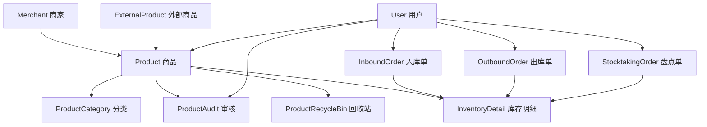

# 商品管理模块 (Goods Module)

## 📋 模块概述

商品管理模块是电商平台的核心模块之一，负责管理商品的完整生命周期，包括商品信息管理、分类管理、库存管理、审核流程、以及外部商品集成等功能。

## 🗂️ 模型文件结构

```
goods/
├── index.js                  # 模块统一导出文件
├── product.js                # 主商品模型
├── productCategory.js        # 商品分类模型
├── productAudit.js          # 商品审核模型
├── productRecycleBin.js     # 商品回收站模型
├── externalProduct.js       # 外部商品库模型
├── inventoryDetail.js       # 库存明细模型
├── inboundOrder.js          # 入库管理模型
├── outboundOrder.js         # 出库管理模型
├── stocktakingOrder.js      # 盘点管理模型
└── README.md                # 本文档
```

## 📝 模型详细说明

### 1. Product (product.js) - 主商品模型

**核心功能：** 商品基本信息管理

**主要字段：**

- `productId`: 唯一商品标识
- `productName`: 商品名称
- `productCategory`: 关联商品分类
- `businessType`: 业务类型（零售/批发/制造/分销）
- `merchant`: 所属商家
- `productInfo`: 商品详细信息（描述、规格、品牌等）
- `pricing`: 价格信息（销售价、市场价、成本价）
- `inventory`: 库存信息（当前库存、总库存、预留库存）
- `status`: 商品状态（待审核、已通过、在售、下架等）
- `auditInfo`: 审核信息
- `isExternal`: 是否外部商品
- `salesData`: 销售数据

**应用场景：**

- 商品列表展示
- 商品详情管理
- 商品状态控制
- 库存监控

### 2. ProductCategory (productCategory.js) - 商品分类模型

**核心功能：** 商品分类体系管理

**主要字段：**

- `businessType`: 业务类型
- `categoryLevel`: 分类级别（1 级/2 级）
- `categoryId`: 分类标识
- `categoryName`: 分类名称
- `parentCategory`: 上级分类
- `categoryImages`: 分类图片（图标、横幅）
- `productCount`: 商品数量统计
- `status`: 分类状态

**应用场景：**

- 商品分类管理页面
- 分类树形结构展示
- 商品归类
- 分类统计分析

### 3. ProductAudit (productAudit.js) - 商品审核模型

**核心功能：** 商品审核流程管理

**主要字段：**

- `auditId`: 审核单号
- `product`: 关联商品
- `merchant`: 所属商家
- `auditStatus`: 审核状态（待审核、已通过、已拒绝）
- `auditType`: 审核类型（新增、修改、删除、恢复）
- `auditor`: 审核人
- `auditReason`: 审核原因
- `changeDetails`: 变更详情
- `priority`: 优先级

**应用场景：**

- 审核列表页面
- 审核流程管理
- 变更记录追踪
- 审核统计报表

### 4. ProductRecycleBin (productRecycleBin.js) - 商品回收站模型

**核心功能：** 已删除商品管理

**主要字段：**

- `originalProduct`: 原商品 ID
- `productSnapshot`: 商品快照数据
- `deleteReason`: 删除原因
- `deletedBy`: 删除人
- `deletedAt`: 删除时间
- `isRestorable`: 是否可恢复
- `autoDeleteAt`: 自动删除时间
- `restoreInfo`: 恢复信息

**应用场景：**

- 回收站页面
- 商品恢复功能
- 数据安全保护
- 误删除数据找回

### 5. ExternalProduct (externalProduct.js) - 外部商品库模型

**核心功能：** 外部商品数据集成

**主要字段：**

- `externalId`: 外部商品 ID
- `sourceSystem`: 来源系统
- `productInfo`: 商品信息
- `categoryInfo`: 分类信息
- `pricing`: 价格信息
- `supplier`: 供应商信息
- `availability`: 可用性状态
- `syncInfo`: 同步信息
- `importStatus`: 导入状态

**应用场景：**

- 外部商品库页面
- 商品数据同步
- 供应商管理
- 商品导入功能

### 6. InventoryDetail (inventoryDetail.js) - 库存明细模型

**核心功能：** 库存变动记录

**主要字段：**

- `detailId`: 明细 ID
- `product`: 关联商品
- `operationType`: 操作类型（入库、出库、调整、盘点）
- `operationReason`: 操作原因
- `quantity`: 数量变化
- `beforeQuantity`: 操作前数量
- `afterQuantity`: 操作后数量
- `relatedOrder`: 关联单据
- `operator`: 操作人

**应用场景：**

- 库存明细页面
- 库存变动追踪
- 数据审计
- 库存分析报表

### 7. InboundOrder (inboundOrder.js) - 入库管理模型

**核心功能：** 入库业务管理

**主要字段：**

- `orderId`: 入库单号
- `merchant`: 所属商家
- `orderType`: 入库类型（采购、退货、调拨、生产、调整）
- `products`: 入库商品列表
- `totalQuantity`: 总数量
- `totalAmount`: 总金额
- `status`: 单据状态
- `warehouse`: 目标仓库
- `supplier`: 供应商

**应用场景：**

- 入库管理页面
- 新增入库单
- 入库审核流程
- 采购管理

### 8. OutboundOrder (outboundOrder.js) - 出库管理模型

**核心功能：** 出库业务管理

**主要字段：**

- `orderId`: 出库单号
- `merchant`: 所属商家
- `orderType`: 出库类型（销售、报损、调拨、退货、调整）
- `products`: 出库商品列表
- `totalQuantity`: 总数量
- `totalAmount`: 总金额
- `status`: 单据状态
- `warehouse`: 源仓库
- `customer`: 客户

**应用场景：**

- 出库管理页面
- 新增出库单
- 出库审核流程
- 销售出库

### 9. StocktakingOrder (stocktakingOrder.js) - 盘点管理模型

**核心功能：** 库存盘点管理

**主要字段：**

- `orderId`: 盘点单号
- `merchant`: 所属商家
- `stocktakingType`: 盘点类型（全盘、抽盘、循环盘点）
- `products`: 盘点商品列表
- `systemQuantity`: 系统数量
- `actualQuantity`: 实盘数量
- `differenceQuantity`: 差异数量
- `status`: 盘点状态
- `warehouse`: 盘点仓库

**应用场景：**

- 盘点管理页面
- 库存盘点计划
- 盘点差异分析
- 库存调整

## 🔗 模型关联关系



## 🚀 核心功能模块

### 📦 商品管理

- **商品列表展示**: 支持多维度筛选和搜索
- **商品信息管理**: 完整的商品属性管理
- **商品状态控制**: 上架、下架、删除等状态管理

### 🔍 审核管理

- **审核流程**: 新增、修改、删除的审核机制
- **审核记录**: 完整的审核历史追踪
- **批量审核**: 提高审核效率

### 🗂️ 分类管理

- **层级分类**: 支持多级分类体系
- **分类统计**: 各分类商品数量统计
- **分类图片**: 支持分类图标和横幅

### 📊 库存管理

- **实时库存**: 准确的库存数量管理
- **库存明细**: 详细的出入库记录
- **库存预警**: 低库存提醒

### 📋 单据管理

- **入库管理**: 多种入库类型支持
- **出库管理**: 销售、调拨等出库场景
- **盘点管理**: 定期和不定期库存盘点

### ♻️ 数据安全

- **回收站机制**: 误删除数据保护
- **数据恢复**: 支持数据快速恢复
- **自动清理**: 过期数据自动清理

### 🔌 外部集成

- **外部商品库**: 支持外部商品数据导入
- **数据同步**: 定时同步外部商品信息
- **供应商管理**: 外部供应商信息维护

## 💾 数据库索引策略

为了提高查询性能，各模型都设置了合理的索引：

- **主键索引**: 所有模型的 ID 字段
- **外键索引**: 关联字段如 merchant、product 等
- **状态索引**: status、auditStatus 等状态字段
- **时间索引**: 创建时间、更新时间等时间字段
- **复合索引**: 常用查询组合字段

## 🔒 数据安全与权限

- **多租户隔离**: 通过 merchant 字段实现数据隔离
- **操作记录**: 所有关键操作都有操作人记录
- **软删除**: 重要数据采用软删除机制
- **数据备份**: 关键数据变更前进行快照备份

## 📈 性能优化

- **分页查询**: 支持高效的分页查询
- **索引优化**: 针对常用查询场景优化索引
- **数据缓存**: 热点数据缓存机制
- **异步处理**: 大批量操作异步处理

## 🔧 使用示例

```javascript
// 导入模型
const {
  Product,
  ProductCategory,
  ProductAudit,
  InventoryDetail,
  InboundOrder,
} = require('./goods');

// 创建商品
const newProduct = new Product({
  productId: 'PROD001',
  productName: '测试商品',
  merchant: merchantId || 'MERCHANT001',
  productCategory: categoryId || 'CATEGORY001',
  businessType: 'retail',
  // ... 其他字段
});

// 保存商品
await newProduct.save();
```

## 📊 统计数据

通过这套模型，可以轻松实现以下统计功能：

- 商品总数统计
- 各分类商品分布
- 库存周转率分析
- 审核通过率统计
- 销售数据分析
- 供应商贡献度分析

## 🛠️ 扩展性

该模型设计考虑了良好的扩展性：

- **字段扩展**: 可通过 Mixed 类型存储扩展属性
- **状态扩展**: 枚举类型便于状态扩展
- **关联扩展**: 支持与其他模块的灵活关联
- **业务扩展**: 支持多种业务类型和场景

## 📞 技术支持

如需技术支持或功能扩展，请联系开发团队。

---

_最后更新时间: 2025 年 8 月 1 日_
_版本: v1.0.0_
