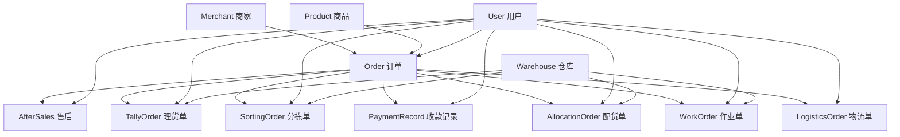

# 订单管理模块 (GoodsOrder Module)

## 📋 模块概述

订单管理模块是电商平台的核心业务模块，负责管理完整的订单生命周期，包括订单处理、售后服务、仓储作业、物流配送等全流程业务管理。该模块与商品模块和商家模块紧密协作，提供全方位的订单管理解决方案。

## 🗂️ 模型文件结构

```
goodsOrder/
├── index.js                 # 模块统一导出文件
├── order.js                 # 主订单模型
├── afterSales.js           # 售后管理模型
├── tallyOrder.js           # 理货单模型
├── sortingOrder.js         # 分拣单模型
├── paymentRecord.js        # 收款记录模型
├── allocationOrder.js      # 配货单模型
├── workOrder.js            # 作业单模型
├── logisticsOrder.js       # 物流单模型
└── README.md               # 本文档
```

## 📝 模型详细说明

### 1. Order (order.js) - 主订单模型
**核心功能：** 订单基础信息管理

**主要字段：**
- `orderId`: 唯一订单标识
- `merchant`: 所属商家
- `orderType`: 订单类型（零售/批发/定制/团购）
- `orderStatus`: 订单状态流转
- `customer`: 客户信息
- `products`: 订单商品列表
- `pricing`: 价格明细
- `delivery`: 配送信息
- `payment`: 支付信息
- `relatedDocuments`: 关联单据

**应用场景：**
- 订单列表展示
- 订单详情管理
- 订单状态跟踪
- 客户订单查询

**状态流转：**
```
待确认 → 已确认 → 已支付 → 处理中 → 已发货 → 已配送 → 已完成
    ↓       ↓       ↓       ↓       ↓       ↓
  已取消   已取消   已退款   已取消   已取消   已取消
```

### 2. AfterSales (afterSales.js) - 售后管理模型
**核心功能：** 售后服务流程管理

**主要字段：**
- `afterSalesId`: 售后单号
- `order`: 关联订单
- `afterSalesType`: 售后类型（退款/换货/维修/投诉）
- `status`: 处理状态
- `customer`: 客户信息
- `applicationInfo`: 申请信息
- `processingInfo`: 处理信息
- `refundInfo`: 退款信息
- `logistics`: 物流信息

**应用场景：**
- 售后列表展示
- 售后申请处理
- 退换货管理
- 客诉处理

### 3. TallyOrder (tallyOrder.js) - 理货单模型
**核心功能：** 仓储理货作业管理

**主要字段：**
- `tallyOrderId`: 理货单编号
- `relatedOrders`: 关联订单
- `tallyType`: 理货类型（入库/出库/调拨/调整）
- `status`: 理货状态
- `products`: 理货商品列表
- `operationInfo`: 作业信息
- `summary`: 汇总信息
- `qualityCheck`: 质检信息

**应用场景：**
- 理货单列表展示
- 理货单详情管理
- 库存作业执行
- 质量检验记录

### 4. SortingOrder (sortingOrder.js) - 分拣单模型
**核心功能：** 分拣作业流程管理

**主要字段：**
- `sortingOrderId`: 分拣单编号
- `sortingType`: 分拣类型
- `status`: 分拣状态
- `priority`: 优先级
- `products`: 分拣商品列表
- `operationInfo`: 作业信息
- `pickingRoute`: 拣货路线
- `qualityCheck`: 复核信息
- `summary`: 统计汇总

**应用场景：**
- 分拣单列表展示
- 分拣单详情管理
- 拣货路线优化
- 分拣质量控制

### 5. PaymentRecord (paymentRecord.js) - 收款记录模型
**核心功能：** 支付收款管理

**主要字段：**
- `paymentId`: 收款单号
- `order`: 关联订单
- `paymentInfo`: 支付信息
- `paymentStatus`: 支付状态
- `transactionInfo`: 交易信息
- `refundInfo`: 退款信息
- `operatorInfo`: 操作员信息
- `reconciliation`: 对账信息

**应用场景：**
- 收款记录查询
- 支付状态跟踪
- 财务对账
- 退款处理

### 6. AllocationOrder (allocationOrder.js) - 配货单模型
**核心功能：** 商品配货管理

**主要字段：**
- `allocationOrderId`: 配货单号
- `allocationType`: 配货类型
- `status`: 配货状态
- `products`: 配货商品列表
- `allocationInfo`: 配货信息
- `summary`: 配货汇总
- `deliveryInfo`: 配送信息
- `urgentInfo`: 紧急信息

**应用场景：**
- 配货单列表展示
- 配货单详情管理
- 库存分配
- 紧急配货处理

### 7. WorkOrder (workOrder.js) - 作业单模型
**核心功能：** 仓储作业任务管理

**主要字段：**
- `workOrderId`: 作业单号
- `workType`: 作业类型（拣货/包装/装车等）
- `status`: 作业状态
- `priority`: 优先级
- `products`: 作业商品列表
- `workPlan`: 作业计划
- `workExecution`: 执行信息
- `qualityControl`: 质量控制
- `performance`: 绩效指标

**应用场景：**
- 作业单列表展示
- 作业单详情管理
- 任务分配调度
- 作业绩效分析

### 8. LogisticsOrder (logisticsOrder.js) - 物流单模型
**核心功能：** 物流配送管理

**主要字段：**
- `logisticsOrderId`: 物流单编号
- `logisticsType`: 物流类型
- `status`: 物流状态
- `logisticsCompany`: 物流公司信息
- `sender`: 发件人信息
- `receiver`: 收件人信息
- `shipmentInfo`: 运输信息
- `driver`: 司机信息
- `tracking`: 物流跟踪
- `cost`: 费用信息
- `deliveryProof`: 配送凭证

**应用场景：**
- 物流单列表展示
- 物流单详情管理
- 物流跟踪查询
- 配送证明管理

## 🔗 模型关联关系



## 🚀 核心功能模块

### 📦 订单管理
- **订单创建**: 支持多种订单类型创建
- **订单编辑**: 订单信息修改和更新
- **状态流转**: 完整的订单状态生命周期
- **订单查询**: 多维度订单查询和筛选

### 🔄 售后管理
- **售后申请**: 客户售后申请处理
- **退换货流程**: 完整的退换货业务流程
- **投诉处理**: 客户投诉和问题解决
- **售后统计**: 售后数据分析和报表

### 🏭 仓储作业
- **理货管理**: 入库、出库、调拨作业
- **分拣操作**: 智能分拣和路线优化
- **质量控制**: 作业质量检验和控制
- **作业调度**: 任务分配和人员调度

### 💰 支付管理
- **收款记录**: 多种支付方式支持
- **支付跟踪**: 支付状态实时跟踪
- **财务对账**: 自动化对账功能
- **退款处理**: 便捷的退款操作

### 📋 配货管理
- **库存分配**: 智能库存分配算法
- **配货计划**: 配货计划制定和执行
- **缺货处理**: 缺货预警和处理
- **紧急配货**: 紧急订单优先处理

### 🚚 物流管理
- **物流调度**: 配送任务分配和调度
- **实时跟踪**: 物流状态实时跟踪
- **路线优化**: 配送路线智能优化
- **签收管理**: 电子签收和凭证管理

## 💾 数据库索引策略

### 主要索引设计
- **订单索引**: orderId, merchant, orderStatus, createdAt
- **客户索引**: customer.customerPhone, customer.customerId
- **时间索引**: 各类时间字段的倒序索引
- **状态索引**: 各种状态字段的索引
- **关联索引**: 外键关联字段的索引

### 复合索引
- **订单查询**: (merchant, orderStatus, createdAt)
- **售后查询**: (merchant, afterSalesType, applicationTime)
- **作业查询**: (merchant, status, priority)

## 🔒 数据安全与权限

### 多租户隔离
- 通过merchant字段实现严格的数据隔离
- 所有查询和操作都基于商家权限控制

### 操作审计
- 所有关键操作都记录操作人和操作时间
- 支持操作历史追踪和审计

### 数据保护
- 敏感信息加密存储
- 支付信息脱敏处理
- 客户隐私信息保护

## 📈 性能优化

### 查询优化
- **分页查询**: 高效的分页实现
- **索引优化**: 针对业务场景的索引设计
- **查询缓存**: 热点数据缓存机制

### 写入优化
- **批量操作**: 支持批量数据处理
- **异步处理**: 重量级操作异步执行
- **数据压缩**: 历史数据压缩存储

## 🔧 业务场景示例

### 1. 订单创建流程
```javascript
// 创建订单
const order = new Order({
  orderId: 'ORD20231201001',
  merchant: merchantId,
  orderType: 'retail',
  customer: {
    customerName: '张三',
    customerPhone: '13800138000'
  },
  products: [{
    product: productId,
    productName: '商品名称',
    quantity: 2,
    unitPrice: 100,
    totalPrice: 200
  }],
  pricing: {
    subtotal: 200,
    totalAmount: 200
  }
});

await order.save();
```

### 2. 售后申请处理
```javascript
// 创建售后申请
const afterSales = new AfterSales({
  afterSalesId: 'AS20231201001',
  order: orderId,
  merchant: merchantId,
  afterSalesType: 'refund',
  applicationInfo: {
    applicationReason: '商品质量问题',
    description: '商品有破损'
  }
});

await afterSales.save();
```

### 3. 理货单生成
```javascript
// 创建理货单
const tallyOrder = new TallyOrder({
  tallyOrderId: 'TLY20231201001',
  relatedOrders: [orderId],
  merchant: merchantId,
  tallyType: 'outbound',
  products: [{
    product: productId,
    productName: '商品名称',
    plannedQuantity: 2
  }]
});

await tallyOrder.save();
```

## 📊 统计分析功能

### 订单统计
- 订单数量统计
- 订单金额统计
- 订单状态分布
- 客户订单分析

### 售后统计
- 售后申请数量
- 售后类型分布
- 处理时效统计
- 客户满意度分析

### 作业效率统计
- 作业完成率
- 作业用时分析
- 人员效率统计
- 设备利用率

### 物流统计
- 配送时效统计
- 配送成本分析
- 签收率统计
- 客户满意度

## 🛠️ 扩展功能

### 工作流引擎
- 支持自定义业务流程
- 可配置的审批流程
- 自动化任务处理

### 消息通知
- 订单状态变更通知
- 作业任务提醒
- 异常情况告警

### 数据分析
- 实时业务监控
- 预测分析
- 趋势分析

### API集成
- 第三方物流对接
- 支付平台集成
- ERP系统集成

## 🔮 未来规划

### 智能化升级
- AI智能分拣
- 智能路线规划
- 预测性库存管理

### 移动化支持
- 移动端作业
- 扫码操作
- 实时定位

### 云服务集成
- 云仓储服务
- 大数据分析
- 机器学习应用

---

## 📞 技术支持

如需技术支持或功能扩展，请联系开发团队。

*最后更新时间: 2025年8月1日*
*版本: v1.0.0*
