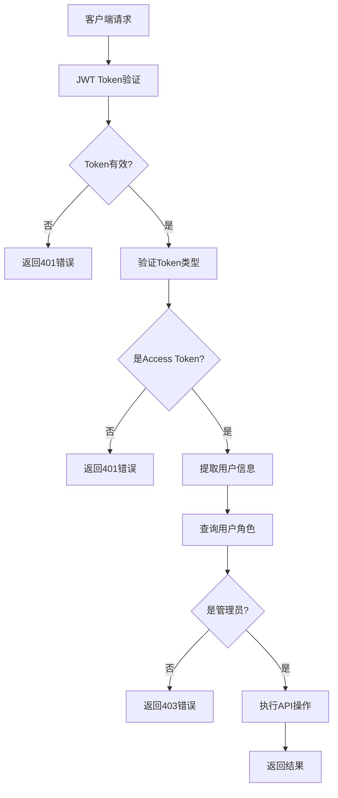

# 用户权限系统修复报告

## 问题诊断

经过对系统的详细检查，发现了以下问题：

### 1. 缺失的权限API接口
前端权限模块调用了以下API路径，但后端没有对应的实现：
- `/api/permissions/my-permissions` - 获取当前用户权限
- `/api/permissions/user-routes` - 获取用户可访问路由
- `/api/permissions/modules` - 获取权限模块
- `/api/permissions/role-templates` - 获取角色权限模板
- `/api/permissions/check-permission` - 检查权限
- `/api/permissions/stats` - 权限统计

### 2. 用户管理API缺少权限验证
以下用户管理API缺少适当的权限检查：
- 获取用户列表
- 获取用户详情
- 创建用户
- 更新用户信息
- 删除用户
- 批量删除用户
- 修改用户权限
- 重置用户密码
- 获取用户统计

## 修复方案

### 1. 新增权限API路由文件

创建了 `backend/routes/permissions.js` 文件，实现了所有缺失的权限相关API：

#### ✅ `/api/permissions/my-permissions` (GET)
- 功能：获取当前用户权限信息
- 权限：需要有效token
- 返回：用户ID、用户名、角色、权限列表、状态

#### ✅ `/api/permissions/user-routes` (GET)  
- 功能：获取用户可访问的路由列表
- 权限：需要有效token
- 返回：基于权限的导航路由树

#### ✅ `/api/permissions/modules` (GET)
- 功能：获取所有权限模块
- 权限：仅管理员可访问
- 返回：完整的权限模块树结构

#### ✅ `/api/permissions/role-templates` (GET)
- 功能：获取角色权限模板
- 权限：仅管理员可访问
- 返回：预定义的角色权限模板

#### ✅ `/api/permissions/check-permission` (POST)
- 功能：检查用户是否具有指定权限
- 权限：需要有效token
- 返回：权限检查结果

#### ✅ `/api/permissions/stats` (GET)
- 功能：获取权限统计信息
- 权限：仅管理员可访问
- 返回：用户角色分布、权限分配统计

### 2. 强化用户管理API权限验证

为所有用户管理API添加了管理员权限检查：

#### ✅ 获取用户列表 (`GET /user-management/users`)
- 新增：仅管理员可访问
- 验证：检查当前用户角色为 'admin'

#### ✅ 获取用户详情 (`GET /user-management/users/:id`)
- 新增：仅管理员可访问
- 验证：检查当前用户角色为 'admin'

#### ✅ 创建用户 (`POST /user-management/users`)
- 新增：仅管理员可创建用户
- 验证：检查当前用户角色为 'admin'

#### ✅ 更新用户信息 (`PUT /user-management/users/:id`)
- 新增：仅管理员可更新用户
- 验证：检查当前用户角色为 'admin'

#### ✅ 删除用户 (`DELETE /user-management/users/:id`)
- 新增：仅管理员可删除用户
- 验证：检查当前用户角色为 'admin'

#### ✅ 批量删除用户 (`DELETE /user-management/users/batch-delete`)
- 新增：仅管理员可批量删除
- 验证：检查当前用户角色为 'admin'

#### ✅ 修改用户权限 (`PUT /user-management/users/:id/permissions`)
- 新增：仅管理员可修改权限
- 验证：检查当前用户角色为 'admin'

#### ✅ 重置用户密码 (`PUT /user-management/users/:id/reset-password`)
- 新增：仅管理员可重置密码
- 验证：检查当前用户角色为 'admin'

#### ✅ 获取用户统计 (`GET /user-management/stats`)
- 新增：仅管理员可查看统计
- 验证：检查当前用户角色为 'admin'

### 3. 配置路由保护

#### ✅ 添加权限路由到Token验证保护
在 `app.js` 中添加了权限路由的token验证：
```javascript
app.use("/api/permissions", jwtAuth, verifyTokenType, permissionsRouter);
```

#### ✅ 确保Token验证链完整
所有权限相关的API都必须通过以下验证链：
1. `jwtAuth` - JWT token验证
2. `verifyTokenType` - 验证token类型为access token
3. 各API内部的角色权限检查

## 安全特性

### 1. Token验证不可跳过
- ✅ 所有权限API都在JWT保护下
- ✅ 所有用户管理API都在JWT保护下
- ✅ 无有效token无法访问任何管理功能

### 2. 角色权限控制
- ✅ 严格的admin角色检查
- ✅ 防止普通用户访问管理功能
- ✅ 详细的权限错误信息

### 3. 数据保护
- ✅ 用户密码字段在所有响应中被过滤
- ✅ 敏感操作记录操作时间
- ✅ 详细的错误日志记录

## 权限验证流程



## 测试建议

### 1. 功能测试
- [ ] 测试所有权限API是否正常返回数据
- [ ] 测试用户管理API的权限控制
- [ ] 测试前端权限设置功能

### 2. 安全测试
- [ ] 尝试无token访问管理API
- [ ] 尝试非管理员用户访问管理功能
- [ ] 验证token过期处理

### 3. 集成测试
- [ ] 前后端权限设置流程完整测试
- [ ] 权限变更实时生效测试
- [ ] 权限模板应用测试

## 注意事项

1. **首次使用**：确保数据库中至少有一个角色为 'admin' 的用户，否则无法访问管理功能

2. **Token配置**：确保JWT配置正确，特别是密钥和过期时间

3. **数据库连接**：确保MongoDB连接正常，权限数据能够正确读写

4. **前端适配**：前端需要正确处理403权限不足的错误

## 下一步优化建议

1. **细粒度权限**：可以考虑实现更细粒度的权限控制，不仅仅依赖角色
2. **权限缓存**：对频繁的权限检查实现缓存机制
3. **操作日志**：添加权限变更的操作日志记录
4. **权限继承**：实现角色权限继承机制
5. **批量权限设置**：支持批量设置多个用户的权限

---

**修复完成时间**: ${new Date().toLocaleString()}
**修复状态**: ✅ 完成
**安全等级**: 🔒 高安全级别
